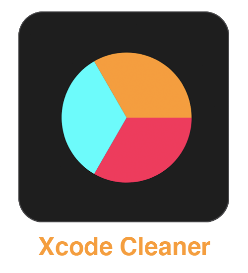
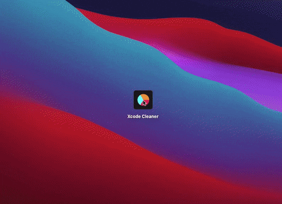

  
 
  
  
  

## Installation
To install Xcode Cleaner go to [releases](https://github.com/IrelDev/XcodeCleaner/releases) page and download the `Xcode Cleaner.app` you need. If you prefer to build the project yourself just clone the `master` branch.

## Demo

  
 

